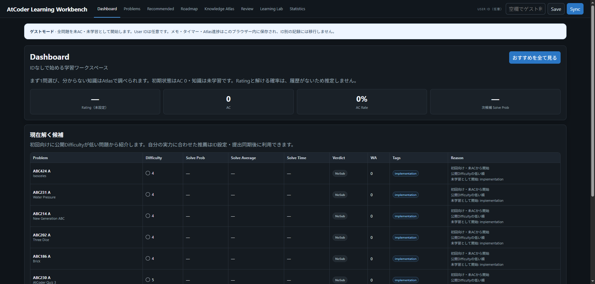
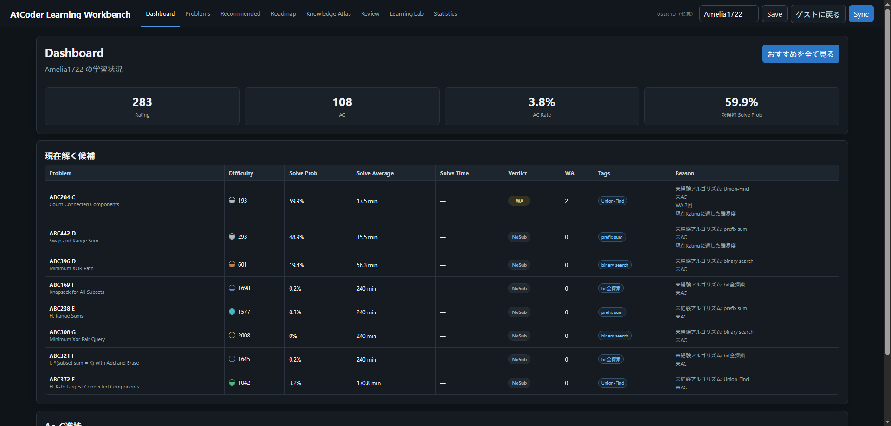

# AtCoder Learning Workbench

**「次に何を学習すればよいか」で迷わないための、AtCoder学習ロードマップ兼ワークスペースです。**

自分のAtCoder IDのAC・WA履歴を使った推薦と、ロードマップ、メモ・タイマー、知識ガイドをまとめたローカルアプリです。次に取り組む問題を選び、分からない知識を確認し、振り返りを残せます。IDなしのゲストでも使い始められます。

## できること

- **学ぶ順番を見つける**：ロードマップと関連知識から、次の学習内容を探す
- **理由を見て問題を選ぶ**：本人IDの未AC・WA履歴・未経験タグなどを基に候補を表示する。ゲストは公開Difficultyが低い順に表示する
- **ヒントの後に理解を確かめる**：ヒント使用後のACをReviewに残し、確認済みの同技法・近いDifficultyの別問題を提案する。条件に合う候補がなければ理由を示す
- **学習を続ける**：問題ごとのメモ・タイマーとKnowledge Atlasを行き来し、Pythonの実行で確認する

## 実画面

### IDなしで始める

ゲストは履歴0件から開始します。Rating・解答確率を推測で埋めず、一般的な候補を表示します。

### 自分の履歴から次の問題を選ぶ

本人提供の画面です。公開提出履歴の集計と推薦理由を確認できます。画像はDashboardの記録で、全機能・全問題の動作保証ではありません。

## ダウンロードして試す

1. **[最新版ZIPをダウンロード](https://github.com/Amelia1722/atcoder-learning-workbench/raw/refs/heads/main/AtCoder-Learning-Workbench-Source-20261007.zip)** し、新しいフォルダーに展開する
2. **launch-review.cmd** をダブルクリックする
3. 準備完了後、**http://127.0.0.1:5173** を開く
4. Learning Lab → **ABC081_A（8件）を開く** → **コードを入力して実行** から、同梱テストを試す

必要環境：**Windows / Python 3.14（py launcher付き）/ Node.js 24（npmを含む）**。初回は固定依存を取得するため通信が必要です。既存の個人DBがあるフォルダーへ上書きしないでください。

詳しい起動・ヒントの操作・保存先（ZIP内 README_JA.md） · テストの再現手順（ZIP内）

## 制作で私が判断したこと

- **自分の履歴で使えること**：本人のAtCoder IDで提出履歴を確認し、次の問題選びにつなげることを要件にしました
- **IDなしでも始められること**：未学習の状態からロードマップや問題を見られることを求めました
- **AC後も理解を確かめること**：ヒント使用後のACだけで理解したと断定せず、同じ技法・近い難易度の別問題で確かめる方針にしました

**私の担当：要件・アイデアの整理、機能の優先順位づけ、操作による受け入れ確認（UAT）。コード実装：AI。**

## 技術構成

- React / TypeScript / Vite：画面と状態管理
- FastAPI / SQLite：ローカルAPI、ID別の学習記録・キャッシュ
- Web Worker / Pyodide：ブラウザー内の学習用Python実行
- ゲストのメモ・タイマー：ブラウザー内に保存

設計・推薦ルール・担当範囲の説明（ZIP内）

## 検証と限界

- 2026-10-07 15:30 JST、R2の新規起動・Labの5問表示・ABC081_Aの8件実行（失敗0件）について本人からUAT合格の報告を受けています。AIによるWindows実機の直接観測とは区別しています
- R2基準版はbackend **359件**・frontend **48件**成功、TypeScript型検査・production build・隔離起動を確認。公開用コピーの再検証と変更範囲は公開版の検証記録（ZIP内）に記載しています
- 同梱カタログは**2,878問**、実行用スターターテストは**5問・102ケース**。全2,878問をテスト済みという意味ではありません
- テストソース一式と現行テストに必要な固定入力を収録しています。過去の任意データを必要とするhistorical profileは、不足時に未実行と明示します
- 元14ZIPの全バンクは同梱していません。公式問題文・サンプル等の由来と公開範囲の確認を分けて扱います
- 推薦は説明可能な加点ルールです。学習効果・解答時間の精度は実証していません。ヒント閲覧から後日の新AC反映までの一連の実操作も未確認です
- 個人用のローカルアプリです。User IDは認証ではありません。ポート8000/5173を外部公開しないでください

同梱内容（ZIP内） · データとプライバシー（ZIP内） · 第三者素材・依存物（ZIP内）

AtCoderの公式サービスではありません。プロジェクト全体へのMIT等の一括ライセンスは付与していません。依存物と上流コンテンツの権利はそれぞれの権利者に帰属します。

## 公開ファイル

上のダウンロードには、アプリ全ソース・テストソース一式・固定依存・起動ツール・検証資料・画像をまとめています。展開後に `README_JA.md` と `docs/` も確認できます。個人DB・認証情報・元14ZIPは含みません。

公開用ソースZIP SHA-256：`91986483bf87e708c80e52b16073e6b49d891550a8663568cdaafa25ee8d83c1`
